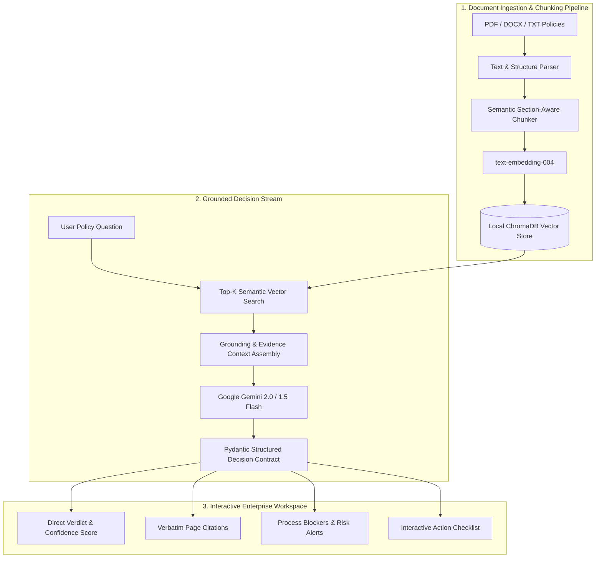

# ⚡ Sanad AI — Enterprise Grounded Decision & Policy Engine

<div align="center">


**Turn 100+ page organizational policies, legal regulations, and vendor contracts into instant, grounded decisions with zero hallucinations.**

[Explore Live Demo](#-quick-start) • [Architecture](#-architecture) • [Key Features](#-key-features) • [Screenshots](#-ui-showcase) • [API Specs](#-api-endpoints)

<br/><br/>

<p align="center">
  
</p>

</div>

---

## 🌟 The Problem & The Transformation (Before vs After)

Organizations spend thousands of hours manually reviewing dense policy handbooks, procurement guidelines, and vendor agreements. 

| Metric / Scenario | ❌ Traditional RAG & Basic Chatbots | ⚡ Sanad AI Decision Engine |
| :--- | :--- | :--- |
| **Output Type** | Long, unstructured text essays | **Structured Verdict + Confidence + Actions** |
| **Hallucination Risk** | High (invents answers when unsure) | **Strict Grounding Contract (Zero hallucination)** |
| **Evidence & Citations** | Vague or non-existent references | **Verbatim quotes + exact page/section anchors** |
| **Policy vs Contract** | Cannot detect legal discrepancies | **Automated Redline Diff & Alignment Score (74%)** |
| **Execution Path** | User is left wondering what to do | **Interactive step-by-step Action Checklist** |

---

## 🏗️ Architecture

Sanad AI couples **Google Gemini 2.0 Flash**, **ChromaDB vector retrieval**, and a **Pydantic Evidence-Constrained Contract** to deliver deterministic enterprise decisions.



---

## 📸 UI Showcase

Sanad AI is built on a bespoke **Obsidian Slate & Warm Amber** enterprise design system.

### 1. Split-Screen Decision Workspace
Split view pairing the source document viewer (with bounding box highlights) alongside the real-time AI decision card, citations, and interactive checklist.


### 2. Knowledge Ingestion & Vector Pipeline
Live 4-stage pipeline tracker (`OCR -> Chunking -> Gemini Embeddings -> ChromaDB Storage`) with system metrics and document catalog.


### 3. Policy vs Contract Discrepancy Engine
Automated side-by-side redline diff comparing baseline corporate policies against vendor draft contracts, featuring a 74% compliance circular gauge and one-click compliant clause generation.


### 4. Enterprise Hero Showcase
High-converting landing page highlighting the value proposition and architecture.


---

* **Strict Grounding & Zero Hallucination:** Constrained to verbatim document context. If a clause is absent, the engine declares insufficient evidence instead of fabricating answers.
* **100% On-Premises & Air-Gapped Support:** Supports running fully offline with Local LLMs (Google Gemma 2, Llama 3 via Ollama) and local ChromaDB for complete enterprise data sovereignty (Zero Data Leakage).
* **Dual-Column Redline Diff:** Compares baseline policies against third-party contracts (e.g. Net-60 vs Net-30 payment terms) and flags non-compliant risks.
* **AI-Powered Amendment Generator:** Generates legally compliant clause replacements in one click.
* **Interactive Action Checklist:** Converts policy requirements into actionable checkboxes (e.g., countersignature on Form B-12).
* **Audit Trail Export:** Export comprehensive compliance reports as **PDF** or **JSON**.
* **Zero-Key Offline Simulation:** Built-in intelligent synthesizer allows instant testing even without a Gemini API key.

---

## 🔒 Enterprise Privacy & Deployment Modes

Sanad AI offers two enterprise deployment modes:

### Mode 1: Cloud-Speed with Google Gemini 2.0
Ideal for general corporate policies and speed:
```env
LLM_PROVIDER=gemini
GEMINI_API_KEY=your_api_key_here
GEMINI_MODEL=gemini-2.0-flash
```

### Mode 2: 100% On-Premises Air-Gapped (Zero Data Leakage)
Strictly for sensitive banks, healthcare, and defense entities where no data can leave the internal network:
```env
LLM_PROVIDER=ollama
OLLAMA_BASE_URL=http://localhost:11434
LOCAL_MODEL_NAME=gemma2:9b
```

---

## ⚡ Quick Start

### 1. Clone & Install Dependencies
```bash
git clone https://github.com/fahimalmas/sanad_ai_decision_engine.git
cd sanad_ai_decision_engine
pip install -r requirements.txt
```

### 2. Configure Environment (Optional)
Create `.env` file (or leave empty to run in zero-key offline mode):
```env
GEMINI_API_KEY=your_gemini_api_key_here
GEMINI_MODEL=gemini-2.0-flash
PORT=8000
```

### 3. Launch Application
```bash
python run.py
```
Open your browser at: **`http://127.0.0.1:8000`**

---

## 🐳 Docker Deployment

Run the complete containerized stack in one command:
```bash
docker build -t sanad-ai-engine .
docker run -p 8000:8000 -e GEMINI_API_KEY="your_api_key" sanad-ai-engine
```

---

## 📡 API Endpoints

| Method | Endpoint | Description |
| :--- | :--- | :--- |
| `GET` | `/` | Serves the interactive Single Page Application UI |
| `GET` | `/api/health` | Returns server health, ChromaDB status, and active models |
| `GET` | `/api/documents` | Lists indexed documents, total chunks, and latency |
| `POST` | `/api/documents/upload` | Uploads and indexes new PDF/DOCX/TXT files into ChromaDB |
| `POST` | `/api/workspace/query` | Evaluates user query and returns grounded decision response |
| `POST` | `/api/discrepancy/audit` | Runs side-by-side policy vs contract redline comparison |
| `POST` | `/api/discrepancy/amendment`| Generates policy-compliant replacement clause |
| `GET` | `/api/export/audit-pdf` | Generates and downloads official PDF compliance report |
| `GET` | `/api/export/audit-json` | Downloads structured JSON audit trail |

---

## 👨‍💻 Author & Lead Engineer

**Fahim Almas (FAHIM ALMAS)**  
*AI Agents & Prompt Engineering Specialist | Full-Stack & Security Engineer*

* 🌐 **Portfolio & Website:** [https://www.fmas.dev/](https://www.fmas.dev/)
* 🐙 **GitHub Profile:** [@fahimalmas](https://github.com/fahimalmas)
* ✉️ **Contact:** [fahim@fmas.dev](mailto:fahim@fmas.dev)
* 🛡️ **Verified Credly Badge:** [Google Cloud – Prompt Design in Vertex AI](https://www.credly.com/badges/34d55684-10d4-4a96-b5bc-775f45df7a28/public_url)
* 🏆 **Certified Credential:** [AI Prompt Engineering Certified](https://omp.dub.ai/certificate/gS2r9rr9EkiN)

---

## 📄 License
Distributed under the MIT License. See `LICENSE` for more information.  
Copyright (c) 2026 Fahim Almas (FAHIM ALMAS - fmas.dev). All rights reserved.
