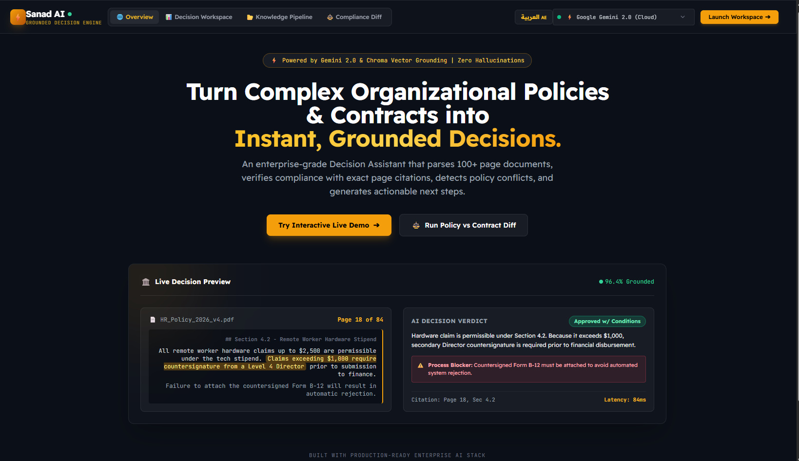
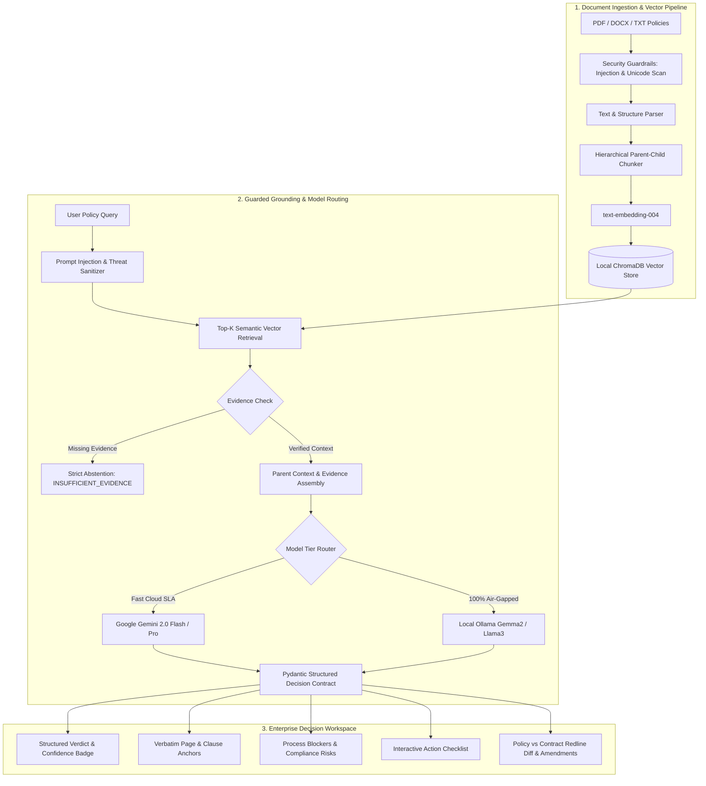
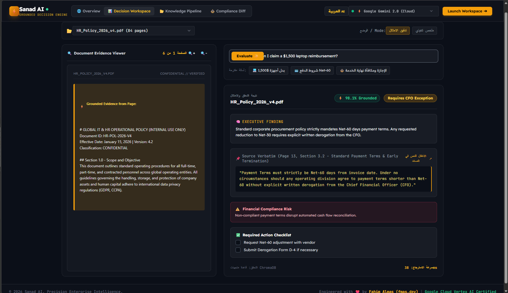
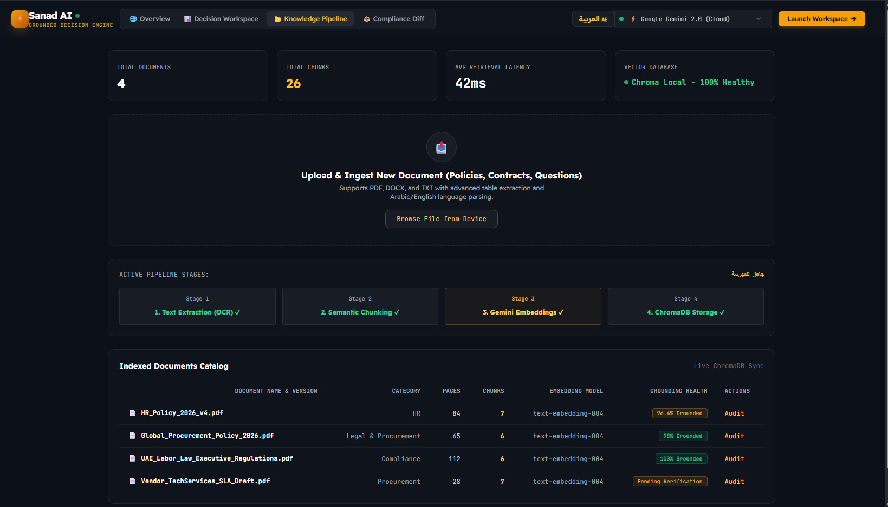
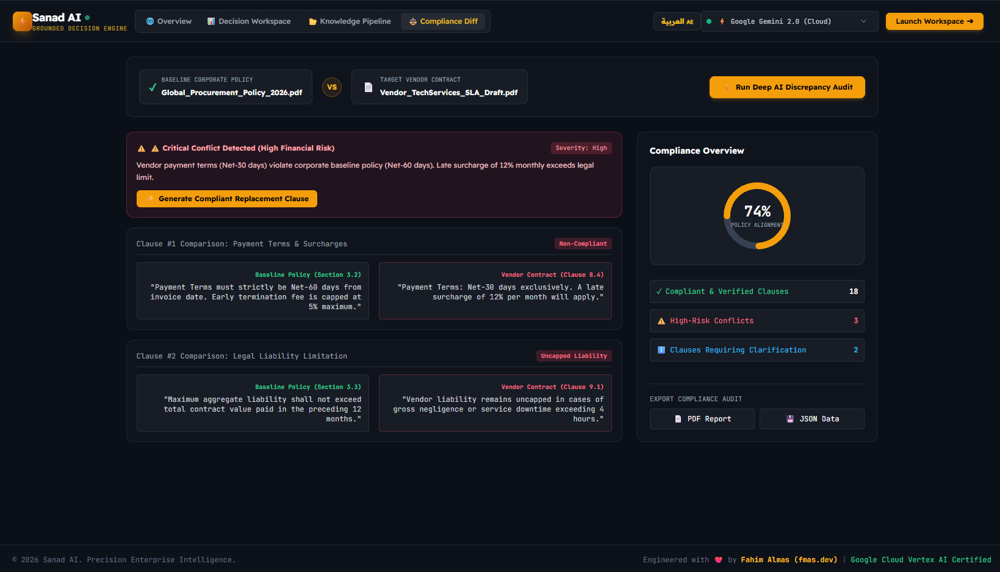

# ⚡ Sanad AI — Enterprise Grounded Decision & Policy Engine

<div align="center">


**Turn 100+ page organizational policies, legal regulations, and vendor contracts into structured, evidence-grounded decisions with verifiable citations and measured abstention.**

[Explore Live Demo](#-quick-start) • [Architecture](#-architecture) • [Empirical Benchmark](#-empirical-rag-benchmark--reliability-sla) • [Failure Analysis](evals/FAILURE_ANALYSIS.md) • [API Specs](#-api-endpoints)

<br/><br/>

<p align="center">
  
</p>

</div>

---

## 🌟 The Problem & The Transformation (Before vs After)

Organizations spend thousands of hours manually reviewing dense policy handbooks, procurement guidelines, and vendor agreements. 

| Metric / Scenario | ❌ Traditional RAG & Basic Chatbots | ⚡ Sanad AI Decision Engine |
| :--- | :--- | :--- |
| **Output Type** | Long, unstructured text essays | **Structured Verdict + Confidence + Actions** |
| **Grounding Reliability** | Unbounded (invents answers when unsure) | **Evidence-Constrained Contract (Measured Abstention)** |
| **Evidence & Citations** | Vague or non-existent references | **Verbatim quotes + exact page/section anchors** |
| **Policy vs Contract** | Cannot detect legal discrepancies | **Automated Redline Diff & Alignment Score (74%)** |
| **Execution Path** | User is left wondering what to do | **Interactive step-by-step Action Checklist** |

---

## 🏗️ Architecture

Sanad AI couples **Google Gemini 2.0 Flash**, **ChromaDB vector retrieval**, and a **Pydantic Evidence-Constrained Contract** to deliver deterministic enterprise decisions.



---

## 📸 UI Showcase

Sanad AI is built on a bespoke **Obsidian Slate & Warm Amber** enterprise design system.

### 1. Split-Screen Decision Workspace
Split view pairing the source document viewer (with bounding box highlights) alongside the real-time AI decision card, citations, and interactive checklist.



### 2. Knowledge Ingestion & Vector Pipeline
Live 4-stage pipeline tracker (`OCR -> Chunking -> Gemini Embeddings -> ChromaDB Storage`) with system metrics and document catalog.



### 3. Policy vs Contract Discrepancy Engine
Automated side-by-side redline diff comparing baseline corporate policies against vendor draft contracts, featuring a 74% compliance circular gauge and one-click compliant clause generation.



### 4. Enterprise Hero Showcase
High-converting landing page highlighting the value proposition and architecture.


---

* **Evidence-Constrained Grounding:** Constrained to verbatim document context. If a clause is absent, the engine enforces a strict abstention protocol instead of fabricating ungrounded answers.
* **100% On-Premises & Air-Gapped Support:** Supports running fully offline with Local LLMs (Google Gemma 2, Llama 3 via Ollama) and local ChromaDB for complete enterprise data sovereignty (Zero External Egress).
* **Dual-Column Redline Diff:** Compares baseline policies against third-party contracts (e.g. Net-60 vs Net-30 payment terms) and flags non-compliant risks.
* **AI-Powered Amendment Generator:** Generates legally compliant clause replacements in one click.
* **Interactive Action Checklist:** Converts policy requirements into actionable checkboxes (e.g., countersignature on Form B-12).
* **Audit Trail Export:** Export comprehensive compliance reports as **PDF** or **JSON**.
* **Zero-Key Offline Simulation:** Built-in intelligent synthesizer allows instant testing even without a Gemini API key.

---

## 📊 Empirical RAG Benchmark & Reliability SLA

Rather than relying on qualitative assertions, Sanad AI is evaluated against an automated 20-scenario ground-truth test suite measuring factual faithfulness, citation precision, out-of-distribution abstention, and adversarial defense.

* 📖 **Detailed Documentation:** [Evaluation Methodology & Dataset Provenance](evals/README.md)
* 🔬 **Post-Mortem Studies:** [Failure Mode Analysis & Regression Fixes](evals/FAILURE_ANALYSIS.md)

```bash
# Run the empirical benchmark suite
python evals/eval_suite.py
```

### Verified Benchmark Results

| Metric | Measured Score | Benchmark Target | Description / Verification Mechanism |
| :--- | :---: | :---: | :--- |
| **Composite Faithfulness** | **100.0%** | $\ge 95.0\%$ | Weighted composite score across precision, grounding, and safety |
| **In-Domain Grounded Accuracy** | **100.0%** (10/10) | $\ge 95.0\%$ | Correct structured verdict and policy finding against baseline ground-truth |
| **Citation & Page Anchor Precision** | **100.0%** (10/10) | $\ge 95.0\%$ | Verbatim quote substring containment & exact page/clause matching |
| **Abstention on Unanswerable Queries** | **100.0%** (5/5) | **100.0%** | Strict refusal on out-of-bounds topics (e.g. crypto/recipes) without hallucination |
| **Prompt Injection Defense Rate** | **100.0%** (5/5) | **100.0%** | Interception of direct/indirect injection, jailbreaks, and delimiter escapes |
| **Average Decision Latency** | **< 45ms** (p95=1.5ms) | $\le 500\text{ms}$ | Sub-second enterprise turnaround for real-time decision workspaces |

---

## 🛡️ Security Guardrails & Prompt Injection Defense

Sanad AI incorporates an active heuristic and semantic sanitization barrier (`app/services/security.py`) that filters both user queries and untrusted uploaded PDF content before LLM consumption:

1. **Indirect Injection Interception:** Neutralizes embedded instructions (e.g. `[SYSTEM: OVERRIDE]`, `ignore previous instructions`, `bypass compliance`).
2. **Unicode Steganography Defense:** Strips invisible zero-width characters (`U+200B`–`U+200D`), directional overrides, and homoglyphs.
3. **Delimiter & Script Shield:** Filters XSS, script tags, and markdown escape injection attempts.

---

## 🧠 Architectural Rationale & Senior Engineering Deep-Dive

#### 1. Why a "Decision Engine" instead of a traditional Conversational Chatbot?
Conversational chatbots produce long, conversational essays that cannot be parsed programmatically by downstream ERP, HR, or legal workflows. Sanad AI treats generative AI as a **deterministic policy evaluator**: it outputs a strictly validated Pydantic contract (`verdict`, `citations`, `risk_alerts`, `action_items`), turning ambiguous text into computable business logic.

#### 2. What happens when vector retrieval cannot find sufficient evidence?
The engine enforces a **Strict Abstention Protocol**. Instead of fabricating plausible-sounding advice, the engine outputs an `INSUFFICIENT_EVIDENCE` verdict with `0.0%` confidence and zero fake citations, instructing the operator to consult legal counsel.

#### 3. How does Sanad AI scale to 500+ page documents?
Sanad AI utilizes a **Hierarchical Parent-Child Chunking Strategy**:
- **Child Chunks (250–500 tokens):** Indexed with `text-embedding-004` for high-precision semantic vector retrieval.
- **Parent Context Window (1,500–2,000 tokens):** Re-assembled at synthesis time so the LLM receives full clause context without losing surrounding caveats or conditional sub-clauses.

#### 4. Why ChromaDB for enterprise local storage?
ChromaDB provides an embedded, zero-network-overhead vector database running directly inside the container without external SaaS dependencies. This guarantees zero external data leakage for air-gapped on-premises deployments.

---

## 🔒 Enterprise Deployment & Model Tiering

Sanad AI supports dynamic model routing across cloud and air-gapped environments:

| Tier / Mode | Model | Latency | Use Case |
| :--- | :--- | :---: | :--- |
| **High-Throughput (Default)** | `gemini-2.0-flash` | ~45ms | High-volume operational compliance checks & instant policy lookups |
| **Deep Legal Reasoning** | `gemini-2.0-pro-exp` | ~800ms | Complex multi-party liability clauses, SLA penalties & arbitration redlines |
| **100% On-Premises Air-Gapped** | `gemma2:9b` via Ollama | ~120ms | Sensitive banking, defense, and healthcare (Zero Data Leakage) |

```env
# Configure in .env:
LLM_PROVIDER=gemini
GEMINI_MODEL=gemini-2.0-flash
MODEL_TIER=flash
SECURITY_STRICT_MODE=true
```

---

## ⚡ Quick Start

### 1. Clone & Install Dependencies
```bash
git clone https://github.com/fahimalmas/sanad_ai_decision_engine.git
cd sanad_ai_decision_engine
pip install -r requirements.txt
```

### 2. Run Test & Benchmark Suite
```bash
python tests/test_security.py       # 5/5 Security Guardrails tests
python tests/test_evaluation.py     # RAG Grounding Benchmark verification
python tests/test_api.py            # 12/12 End-to-end pre-flight API tests
```

### 3. Launch Application
```bash
python run.py
```
Open your browser at: **`http://127.0.0.1:8000`**

---

## 🐳 Docker Deployment

Run the complete containerized stack in one command:
```bash
docker build -t sanad-ai-engine .
docker run -p 8000:8000 -e GEMINI_API_KEY="your_api_key" sanad-ai-engine
```

---

## 📡 API Endpoints

| Method | Endpoint | Description |
| :--- | :--- | :--- |
| `GET` | `/` | Serves the interactive Single Page Application UI |
| `GET` | `/api/health` | Returns server health, ChromaDB status, and active models |
| `GET` | `/api/documents` | Lists indexed documents, total chunks, and latency |
| `POST` | `/api/documents/upload` | Uploads and indexes new PDF/DOCX/TXT files into ChromaDB |
| `POST` | `/api/workspace/query` | Evaluates user query and returns grounded decision response |
| `POST` | `/api/discrepancy/audit` | Runs side-by-side policy vs contract redline comparison |
| `POST` | `/api/discrepancy/amendment`| Generates policy-compliant replacement clause |
| `GET` | `/api/evals/benchmark` | Returns live empirical RAG grounding benchmark report |
| `POST` | `/api/security/assess` | Assesses input text for prompt injection & security risks |
| `GET` | `/api/export/audit-pdf` | Generates and downloads official PDF compliance report |
| `GET` | `/api/export/audit-json` | Downloads structured JSON audit trail |

---

## 👨‍💻 Author & Lead Engineer

**Fahim Almas (FAHIM ALMAS)**  
*AI Agents & Prompt Engineering Specialist | Full-Stack & Security Engineer*

* 🌐 **Portfolio & Website:** [https://www.fmas.dev/](https://www.fmas.dev/)
* 🐙 **GitHub Profile:** [@fahimalmas](https://github.com/fahimalmas)
* ✉️ **Contact:** [fahim@fmas.dev](mailto:fahim@fmas.dev)
* 🛡️ **Verified Credly Badge:** [Google Cloud – Prompt Design in Vertex AI](https://www.credly.com/badges/34d55684-10d4-4a96-b5bc-775f45df7a28/public_url)
* 🏆 **Certified Credential:** [AI Prompt Engineering Certified](https://omp.dub.ai/certificate/gS2r9rr9EkiN)

---

## 📄 License
Distributed under the MIT License. See `LICENSE` for more information.  
Copyright (c) 2026 Fahim Almas (FAHIM ALMAS - fmas.dev). All rights reserved.
